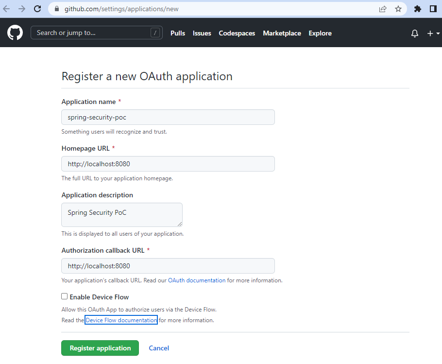
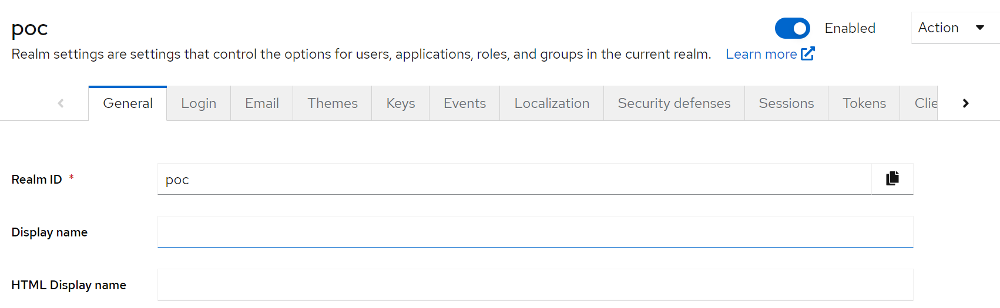
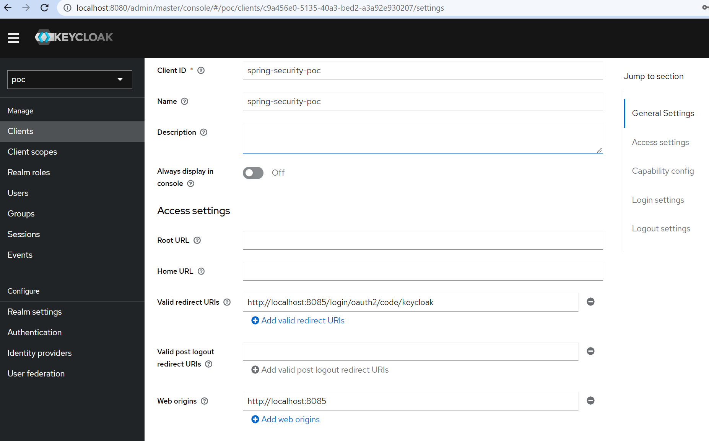
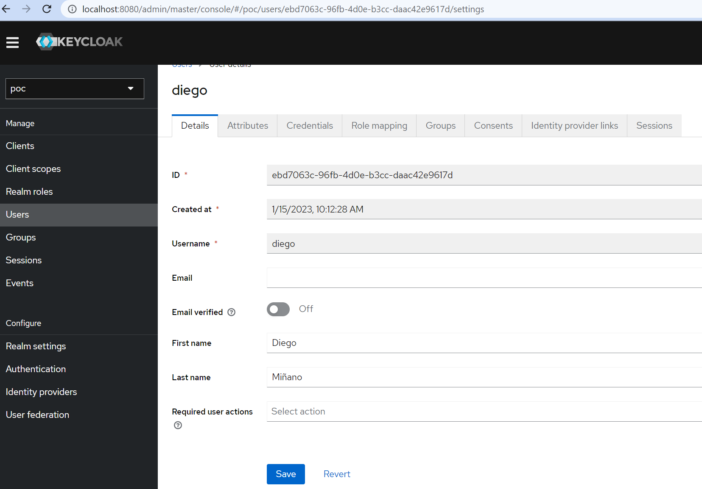

# Introduction
This is a PoC to test Spring Security features. 

## Single sign-on application, github as authorization server 
In this case I´m using GitHub as the authorization server,
and focus on the communication between the components with the ***authorization code*** grant type.

When adding a new OAuth application, some parameter need to be specified, a name for the application
the homepage and the link to which GitHub will make the call back to your application.

The OAuth 2 grant type on which this works is the authorization code grant type. 
This grant type assumes that the client redirects the user to the authorization server (GitHub, in this case) for login, 
and then the authorization server calls the client back at a defined URL.

1. Configure authorization server
https://github.com/settings/applications/new



2. Create Spring Boot Application with the following dependencies:
```
    <dependency>
        <groupId>org.springframework.boot</groupId>
        <artifactId>spring-boot-starter-oauth2-client</artifactId>
	</dependency>
    <dependency>
        <groupId>org.springframework.boot</groupId>
        <artifactId>spring-boot-starter-security</artifactId>
    </dependency>
    <dependency>
        <groupId>org.springframework.boot</groupId>
        <artifactId>spring-boot-starter-web</artifactId>
    </dependency>
```

3. Configure the Bean SecurityFilterChain to enable OAuth2 authentication.
```
    @Bean
    public SecurityFilterChain filterChain(HttpSecurity http) throws Exception {
        http
            .authorizeHttpRequests((auth) -> auth
                .anyRequest().authenticated()
            )
            .oauth2Login(); // This is setting the kind of authentication filter (OAuth2LoginAuthenticationFilter)
                            // to intercept the request and apply OAuth 2 authentication logic.
        return http.build();
    }
```

4. Configure the client provider 
```
spring.security.oauth2.client.registration.github.client-id=[the client id I got from step 1]
spring.security.oauth2.client.registration.github.client-secret=[the secret I got from step 1]
```

## Single sign-on application, Keycloak as authorization server
I'm using a basic Keycloak setup for this demo.

1. Run Keycloak
```
docker run -p 8080:8080 -e KEYCLOAK_ADMIN=admin -e KEYCLOAK_ADMIN_PASSWORD=admin quay.io/keycloak/keycloak:20.0.3 start-dev
```
Be aware I'm providing an admin user 'admin/admin' via env parameters.
2. Create Realm


3. Configure client

4. Configure the client provider
```
spring.security.oauth2.client.registration.keycloak.client-id=spring-security-poc
spring.security.oauth2.client.registration.keycloak.clientName=Keycloak
spring.security.oauth2.client.registration.keycloak.authorization-grant-type=authorization_code
spring.security.oauth2.client.registration.keycloak.scope=openid
spring.security.oauth2.client.provider.keycloak.issuer-uri=http://localhost:8080/realms/poc
spring.security.oauth2.client.provider.keycloak.user-name-attribute=preferred_username
```
5. Create a user

6. 
## Restricting access by roles
// TODO


# References
Spring Security in Action - https://learning.oreilly.com/library/view/spring-security-in
WebSecurityConfigurerAdapter deprecation - https://spring.io/blog/2022/02/21/spring-security-without-the-websecurityconfigureradapter
Spring Oauth2 - https://docs.spring.io/spring-security/site/docs/5.2.12.RELEASE/reference/html/oauth2.html
Keycloak basic setup - https://www.keycloak.org/getting-started/getting-started-docker
